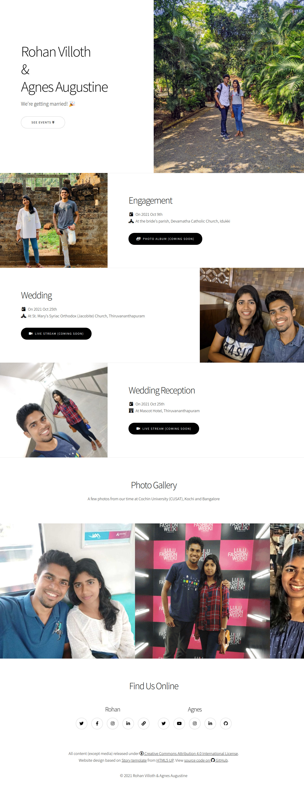

# Rohan &amp; Agnes
Wedding website for Rohan Villoth &amp; Agnes Augusthy

- On Netlify: [RohanAgnes.netlify.com](https://RohanAgnes.netlify.com)
- On GitHub Pages: [HEXcube.github.io/RohanAgnes](https://HEXcube.github.io/RohanAgnes)

## HOW TO
This is a single page website, with only `index.html`. the other pages `index-base.html` and
`index-demo.html` are reference pages inherited from the template and not used on live website.
The scripts and media in `assets` and `images` pages are unmodified from the template for use
with reference pages while testing and development. All new assets for this website go into
`media` folder.

## CREDITS
- Based on [Story template](https://html5up.net/story) from [HTML5 UP](https://html5up.net)
- Icons from [Font Awesome 5](https://fontawesome.com)
- [jQuery](https://jquery.com)
- [Scrollex](https://github.com/ajlkn/jquery.scrollex)
- [Responsive Tools](https://github.com/ajlkn/responsive-tools)
- Favicon derived from [couple icon on Noun Project](https://thenounproject.com/term/couple/688840/)
- Favicons and theme colors generated from [Real Favicon Generator](https://realfavicongenerator.net)
- Social media and link meta tags generated from [MetaTags.io](https://metatags.io)
- Thumbnail and meta link previews cached by [GitHack CDN](https://raw.githack.com)

## LICENSE
Being based on [Story template](https://html5up.net/story) from [HTML5 UP](https://html5up.net/license),
this website is released under [Creative Commons Attribution 4.0 International License](https://creativecommons.org/licenses/by/4.0/).
However, images and media are personal property, not meant to be shared without permission.

## PREVIEW

